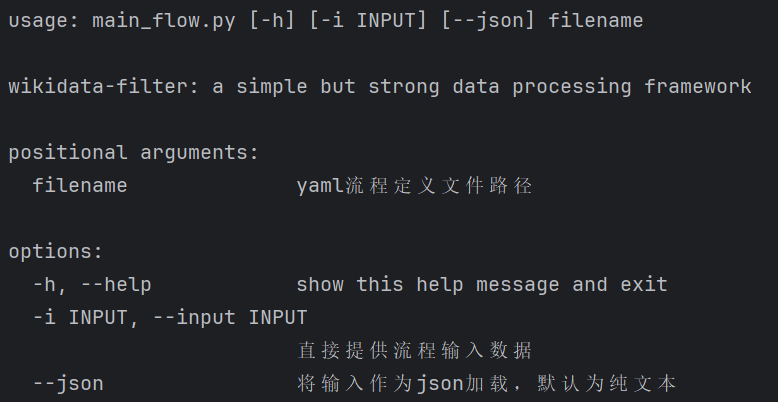

# wikidata-filter
一个简单实用、灵活可配、开箱即用的Python数据处理（ETL）框架，提供**Wikidata** / **Wikipedia** / **GDELT**等多种开源情报数据的处理流程；
支持**大模型**、**API**、常见文件、数据库等多种输入输出及转换处理，支撑各类数据接入、大数据处理、AI智能分析任务。

项目持续丰富中，欢迎反馈各类数据处理需求，持续丰富Data Intelligence



关于wikidata知识图谱的介绍，可以参考作者的一篇博客文章 https://blog.csdn.net/weixin_40338859/article/details/120571090


**项目扩展模式**： 
1. 基于源码的扩展： 
- 直接在本项目中修改已有实现或更加更多实现，可在`wikidata_filter`模块下进行 
- 在本项目顶层（与`wikidata_filter`模块并行）添加更多模块 
- 新建项目引用当前项目进行组件开发，并在`wikidata_filter`模块下添加引用（比如添加`wikidata_filter.addon`引入相关组件）。需要注意避免组件的循环引用。 

2. 【计划中】基于组件的方式
新建项目引用当前项目进行组件开发，在新项目中启动，需要在框架中注册组件
【计划中】下一步实现项目打包、安装包上传仓库。


## New！
- 2024.11.28
1. 新增PDF文件加载器 `pdf.PDF(input_file, max_pages=0)` 基于PDFMiner读取PDF文件，每页文本作为一条数据
2. 新增Word doc/docx文件加载器 `docx.Doc(input_file)` `docx.Docx(input_file)` 基于python-docx读取docx文件，doc则先通过libreoffice转换为docx，每个段落、表格作为一条数据
3. 新增Parquet文件加载器 `parquet.Parquet(input_file)` 基于pyarrow读取parquet文件，每行作为一条数据
4. 对应增加三个示例流程：[pdf文件加载](flows/file_pdf.yaml) [docx文件加载](flows/file_docx.yaml) [parquet文件加载](flows/file_parquet.yaml)


## 项目特色
1. 通过**yaml**格式定义流程，上手容易
2. 内置数十种ETL算子，配置简单，包括大模型处理、数据库读写、API访问、文件读写等多种类型
3. 内置特色数据资源处理流程，开箱即用：
   - [wikipedia 维基百科页面处理](wikipedia_page.py) [建立索引](flows/index_wikipedia.yaml) [ES索引配置](config/es-mappings/enwiki.json)
   - [wikidata 维基数据](flows/p1_wikidata_graph.yaml)
   - [GDELT 谷歌全球社会事件数据库 （流式，直接下载）](flows/gdelt.yaml)
   - [GTD 全球恐怖主义事件库](flows/gtd_local.yaml)
   - [民调数据（经济学人美国大选专题）](flows/polls.yaml)
   - [预测市场数据](flows/futures.yaml)
   - [OpenSanctions全球制裁实体名单或涉政治、犯罪与经济重点人物、公司](flows/opensanctions_peps.yaml) [测试数据](test_data/opensanctions-entities.ftm.json)
   - [联合国教科文组织项目数据](flows/unesco-projects.yaml)
   - [FourSqure全球POI数据](flows/file_parquet.yaml)
   - [新闻文本解析&向量化索引](flows/news_process.yaml)
   - 文档文件读取 [pdf](flows/file_pdf.yaml) [docx](flows/file_docx.yaml)
   - [ReaderAPI](flows/test_readerapi.yaml)
   - [大模型处理](flows/llm_simple.yaml)
   - more...


## 核心概念
- Flow: 处理流程，实现数据载入（或生成）、处理、输出的过程
- Loader：数据加载节点（对应flume的`source`） 
- Iterator：数据处理节点，用于表示各种各样的处理逻辑，包括数据输出与写入数据库（对应flume的`sink`）  
- Matcher：数据匹配节点，是一类特殊的`JsonIterator`，可作为函数调用
- Engine：按照Flow的定义进行执行。简单Engine只支持单线程执行。高级Engine支持并发执行，并发机制通用有多线程、多进程等

## 快速使用
1. 安装依赖
```shell
 pip install -r requirements.txt
```

2. 查看帮助
```shell
 python main_flow.py -h
```

3. 流程定义

- 示例1：加载联合国教科文组织的项目清单CSV文件，按受益国家分组，统计项目数量、总预算、总支出 [查看详情](flows/unesco-projects-aggs.yaml) [流程对比](flows/unesco-projects.yaml)

```yaml
loader: CSV('test_data/unesco-projects-20241113.csv')

nodes:
  print: Print
  rename1: RenameFields(**rename)
  group: Group(by='beneficiary_country', emit_fast=False)
  g_count: aggs.Count
  g_total_budget: aggs.Sum('budget')
  g_total_cost: aggs.Sum('cumulative_cost')

processor: Chain(rename1, group, g_total_cost, print)
```

- 示例2：输入wikidata dump文件（gz/json）生成id-name映射文件（方便根据ID查询名称），同时对数据结构进行简化，[查看详情](flows/p1_idname_simple.yaml)
```yaml
name: p1_idname_simple
arguments: 1

loader: WikidataJsonDump(arg1)

nodes:
  n1: IDNameMap
  n2: WriteJson('data/id-name.json')
  n3: Simplify
  n4: SimplifyProps
  n5: WriteJson('test_data/p1.json')
  chain1: Chain(n1, n2)
  chain2: Chain(n3, n4, n5)

processor: Fork(chain1, chain2)
```

- 示例3：基于wikidata生成简单图谱结构，包含Item/Property/Item_Property/Property_Property四张表 [查看详情](flows/p1_wikidata_graph.yaml)
```yaml
name: p1_wikidata_graph
description: transform wikidata dump to graph, including item/property/item_property/property_property
arguments: 1

loader: WikidataJsonDump(arg1)

nodes:
  writer1: WriteJson('test_data/item.json')
  writer2: WriteJson('test_data/property.json')
  writer3: WriteJson('test_data/item_property.json')
  writer4: WriteJson('test_data/property_property.json')

  rm_type: RemoveFields('_type')

  entity: wikidata_graph.Entity
  filter_item: "Filter(lambda p: p['_type']=='item')"
  filter_property: "Filter(lambda p: p['_type']=='property')"
  chain1: Chain(filter_item, rm_type, writer1)
  chain2: Chain(filter_property, rm_type, writer2)
  group1: Fork(chain1, chain2)

  property: wikidata_graph.ItemProperty
  filter_item_property: "Filter(lambda p: p['_type']=='item_property')"
  filter_property_property: "Filter(lambda p: p['_type']=='property_property')"
  chain3: Chain(filter_item_property, rm_type, writer3)
  chain4: Chain(filter_property_property, rm_type, writer4)
  group2: Fork(chain3, chain4)

  chain_entity: Chain(entity, group1)
  chain_property: Chain(property, group2)

processor: Fork(chain_entity, chain_property)
```

4. 启动流程
```shell
 python main_flow.py <flow-file-path>
```

## 应用场景
本项目具有众多数据处理分析应用场景：
- 数据结构转换
- 数据库备份、同步
- 数据采集（如GDELT数据）
- 数据解析与NLP处理
- 索引构建，包括全文索引、向量索引
- 知识图谱构建
- Web API功能/数据集成
- 服务监测
- 离线数据分析
- ...

可以在[这里](flows)找到很多开箱即用的流程。


## 使用者文档 User Guide

YAML Flow [Flow 格式说明](docs/yaml-flow.md)

数据加载器 [Loader 说明文档](docs/loader.md)

处理节点（过滤、转换、输出等） [Iterator 说明文档](docs/iterator.md)

辅助函数 [util 说明文档](docs/util.md)


## 开发者文档 Developer Guide

详细设计说明[设计文档](docs/main-design.md)

Flow流程配置设计[可配置流程设计](docs/yaml-flow-design.md)

## 开发日志
- 2024.11.24
1. 新增`wikidata_filter.test`模块，作为框架扩展示例：通过在`wikidata_filter`中添加引用，可引入外部扩展模块，从而实现项目集成

- 2024.11.23
1. 新增`aggs`算子模块，提供基本的聚合统计功能，配合`Group`使用。包括`Reduce` `ReduceBy` `Count` `Sum` `Mean` `Min` `Max` `Std` `Var`
 以及 `Head` `Tail` `Sample` `Distinct` `OrderBy`等
2. 新增`sample.Distinct` 以支持去重，可重写其`exists(val)`方法实现更加高级的重复数据判别


- 2024.11.21
1. 新增采样算子`Sample(rate=0.01)` 对数据进行采样

- 2024.11.19
1. 新增文件夹加载器`Directory(paths, *suffix, recursive=False, type_mapping=None, **kwargs)` 根据文件后缀名调用具体的加载器进行加载（.txt .json .jsonl .jsonf .jsona .xls）
2. 新增[文件夹处理流程](flows/directory_loader.yaml)
3. 修改Flat处理逻辑

- 2024.11.17
1. `JsonIterator`增加`__process__(data)`方法，如果需要接收特殊消息（如结束END/定时TIMEOUT/刷新FLUSH），则重写此方法。默认逻辑为如果data不为None，调用`on_data`进行具体数据处理。
2. 流程中不需要显示生命finish_sinal，`run`在数据结束后自动发送一个特殊消息`Message.end()`
3. 为大部分组件添加`__str__`实现 方便展示组件对象信息
4. 新增联合国教科文组织项目数据处理流程[查看](flows/unesco-projects.yaml)及相关[测试数据](test_data/unesco-projects-20241113.csv)

- 2024.11.16
1. 重写 `Chain`处理逻辑，可作为普通节点提供输出；判断每个子节点输出，如果是生成器，则用for获取
2. 重写`run`方法，针对部分处理节点的`on_data`方法可能包含`yield`（对应返回为生成器），对结果进行判断
3. 新增[`openapi`JSON文件](test_data/opensanctions-openapi.json)结构解析算子 `iterator.web.openapi.FromOpenAPI`和`iterator.web.openapi.ToOpenAPI`
4. 新增**OpenSanctions**FTM数据格式的人员`Person`转换流程[查看](flows/opensanctions_peps.yaml)
5. 新增属性提升处理算子 `FlatProperty(*keys, inherit_props=False)` 返回特定字段的值

- 2024.11.09
1. 新增文本分段算子 `nlp.splitter.TextSplit(key, target_key, algorithm='simple')` 实现文本chunk化，便于建立向量化索引。chunk算法持续扩展
2. 新增qdrant数据库算子 `database.Qdrant(host: str = 'localhost', port: int = 6333, api_key=None, collection: str = "chunks", buffer_size: int = 100, vector_field='vector')`
3. 新增向量化算子 `model.embed.Local(api_base: str, field: str, target_key: str = '_embed')` 调用向量化服务实现对指定文本字段生成向量。下一步实现OpenAI接口的向量化算子
4. 修改[新闻处理流](flows/news_process.yaml)，增加分段->向量化->写入qdrant的处理节点

- 2024.11.04
1. 新增轮询加载器`TimedLoader(loader)` 可基于一个已有的加载器进行定时轮询 适合数据库轮询、服务监控等场景
2. 新增URL加载器`web.api.URLSimple(url)` 接口返回作为JSON数据传递
3. 修改`flow_engine` 实现nodes中定义loader （节点名以"loader"开头）
4. 新增流程[查看](flows/api_monitor.yaml) 实现对URL接口持续监控

- 2024.11.01
1. 增加工具模块 `util.dates`，可获取当前时间`util.dates.current()`(秒) `util.dates.current_date()`（字符串） `util.dates.current_ts()`（毫秒）
2. 增加工具模块 `util.files`，读取文本文件 `util.files.read_text(filename)`
3. 增加Loader `JsonFree` 读取格式化JSON文件，自动判断json对象边界
4. 简化几个Loader的命名：`Text` `Json` `JsonLine` `JsonArray` `CSV` `Excel` `ExcelStream`

- 2024.10.28
1. 合并`Converter`、`FieldConverter`到`Map`算子，支持对字段进行转换，支持设置目标字段
2. 修改`Select`以支持嵌套字段`user.name.firstname`形式
3. 新增天玑大模型接口调用`GoGPT(api_base,field,ignore_errors,prompt)`
4. 新增一个[新闻处理流程](flows/news_process.yaml) 通过提示大模型实现新闻主题分类、地名识别并并建立ES索引
5. 新增文本处理算子模块 `iterator.nlp` 提供常用文本处理
6. 为基类`JsonIterator`增加_set链式方法，简化算子属性设置和子类实现（子类__init__不需要设置每个基类参数）比如可以写：`WriteJson('test_data/test.json')._set(buffer_size=50)`
7. 重新实现缓冲基类`Buffer`（具有一定大小的缓冲池）、缓冲写基类`BufferedWriter`，文本写基类`WriteText`继承`BufferedWriter`

- 2024.10.27
1. 修改`main_flow` 支持参数设置，详细查看帮助：`python main_flow.py -h` 支持通过命令行提供loader数据
2. 增加两个简单的loader组件：`ArrayProvider(arr)`、`TextProvider(txt, sep='\n')` 可参考[简单流程](flows/test_simple.yaml)
3. 简化各流程文件的参数设置 方便快速使用

- 2024.10.26
1. 新增大模型处理算子`LLM` 可调用与OpenAI接口兼容的在线大模型接口，需要提供api_base、api_key，其他参数支持：model、proxy、prompt、temp等
2. 基于`LLM`实现月之暗面（Kimi）大模型`Moonshot`、Siliconflow平台大模型`Siliconflow`大模型算子
3. 新增大模型调用流程示例[查看](flows/llm_simple.yaml) 填入api_key即可执行：`python main_flow.py flows/llm_local.yaml`
4. 增加一些测试流程的测试样例数据[查看](test_data)
5. 修改`JsonMatcher`，继承`Filter`，使得匹配对象可以直接作为过滤算子（之前是作为`Filter`的参数） `matcher`移动到`iterator`下
6. 简化iterator的配置，nodes和processor定义的节点都可以不写`iterator` 如可以写`web.gdelt.Export`
7. 支持获取环境变量，在consts中声明，如`api_key: $OPENAI_KEY` 表示从环境变量中读取OPENAI_KEY的值并赋给api_key
8. 对多个流程补充描述说明

- 2024.10.25
1. 修改GDLET数据加载器`GdeltTaskEmit` 调整睡眠模式 避免访问还未生成的zip文件
2. 新增`FieldConvert(key, converter)`算子，实现对指定字段进行类型转换，转换子为任意支持一个参数的函数 如`int` `float` `str` `bool`、`util.lang_util.zh_simple`等
3. 新增`Convert(converter)`算子，实现对记录的类型转换，转换子包括`int` `float` `str` `bool`等

- 2024.10.24
1. 新增GDELT处理流程，持续下载[查看](flows/gdelt.yaml) 滚动下载export.CSV.zip文件
2. 增加新的Loader `GdeltTaskEmit` 从指定时间开始下载数据并持续跟踪
3. 新增经济学人民调数据处理算子 `iterator.web.polls.PollData` （需要手工下载CSV）、处理流程[查看](flows/polls.yaml)
4. 修改`Flat`算子逻辑，如果输入为`dict`，则提取k-v，如果v也是`dict`，则把k填入v中（_key），最后输出v

- 2024.10.17
1. 添加多个处理算子：FieldJson、Flat、FlatMap、AddFields [查看](docs/iterator.md)
2. 初步添加规约类算子：BufferBase Reduce GroupBy

- 2024.10.15
1. 修改CkWriter参数为 username tcp_port 明确使用TCP端口（默认9000，而不是HTTP端口8123）
2. 新增字段值 String -> Json 算子 `FieldJson(key)`
3. 新增加载json文件到ClickHouse流程[查看](flows/db_import_mongo.yaml)
4. 新增ClickHouse表复制的流程[查看](flows/db_copy_clickhouse.yaml)

- 2024.10.14
1. 新增 MongoWriter
2. 新增 MongoDB表复制流程[查看](flows/db_copy_mongo.yaml)

- 2024.10.02
1. WriteJson WriterCSV增加编码参数设置
2. 新增GDELT本地数据处理的简化流程[查看](flows/gdelt_local.yaml) 通过加载本地文件转化成JSON

- 2024.09.30
1. 集成Reader API（`wikidata_filter.iterator.web.readerapi` 详见 https://jina.ai/reader/)
2. 增减文本文件加载器 TxtLoader（详见 `wikidata_filter.loader.file.TxtLoader`）
3. 新增Reader API的流程 [查看](flows/test_readerapi.yaml) 加载url列表文件 实现网页内容获取
